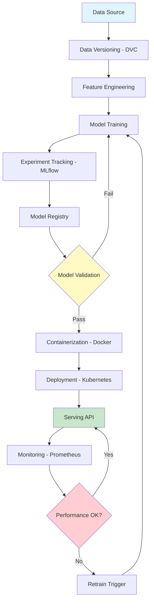
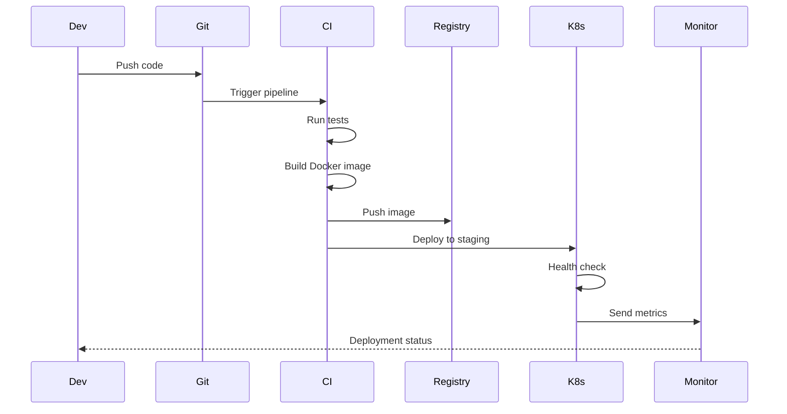

# MLOps Production Pipeline

<div align="center">


**Complete MLOps pipeline with experiment tracking, model versioning, deployment, and monitoring**

[English](#english) | [Português](#português)

</div>

---

## English

## 📊 MLOps Architecture



## 🔄 CI/CD Pipeline




### 📋 Overview

Production-ready MLOps pipeline implementing best practices for machine learning operations. Includes data versioning (DVC), experiment tracking (MLflow), model registry, containerization (Docker), orchestration (Kubernetes), CI/CD (GitHub Actions), monitoring (Prometheus/Grafana), and automated retraining.

### 🎯 Key Features

- **Data Versioning**: DVC for dataset and feature versioning
- **Experiment Tracking**: MLflow for metrics, parameters, and artifacts
- **Model Registry**: Centralized model management and versioning
- **Containerization**: Docker for reproducible environments
- **Orchestration**: Kubernetes for scalable deployment
- **CI/CD**: Automated testing and deployment pipelines
- **Monitoring**: Real-time model performance tracking
- **A/B Testing**: Gradual rollout and comparison

#

### 📊 Pipeline Performance Metrics

Real-world MLOps pipeline performance across all stages:


#### Performance Summary

| Stage | Success Rate | Avg Time | Key Metrics |
|-------|--------------|----------|-------------|
| **Data Validation** | 98.5% | 5 min | Schema compliance, data quality checks |
| **Feature Engineering** | 97.2% | 12 min | Feature generation, transformations |
| **Model Training** | 95.8% | 45 min | Training convergence, hyperparameter tuning |
| **Model Validation** | 96.5% | 8 min | Performance metrics, bias detection |
| **Deployment** | 99.1% | 3 min | Container build, service health checks |
| **Monitoring** | 97.8% | 1 min | Metrics collection, alerting |

**Key Insights:**
- **High Reliability**: All stages maintain >95% success rate
- **Deployment Excellence**: 99.1% success rate ensures stable production releases
- **Training Bottleneck**: Model training takes 45 minutes on average (optimization opportunity)
- **Fast Monitoring**: Real-time monitoring with 1-minute cycle time
- **Overall Pipeline**: ~74 minutes end-to-end (data to production)

#### Optimization Recommendations

1. **Model Training**: Implement distributed training to reduce from 45 to ~20 minutes
2. **Feature Engineering**: Cache intermediate results to improve from 12 to ~8 minutes
3. **Parallel Execution**: Run validation and monitoring in parallel where possible
4. **Auto-scaling**: Dynamic resource allocation based on workload

#### Monitoring & Alerting

The pipeline includes comprehensive monitoring:
- **Performance Metrics**: Latency, throughput, error rates
- **Model Metrics**: Accuracy, precision, recall, drift detection
- **Infrastructure**: CPU, memory, disk, network utilization
- **Business Metrics**: Predictions served, revenue impact


## 🚀 Quick Start

```bash
git clone https://github.com/galafis/mlops-production-pipeline.git
cd mlops-production-pipeline

# Start MLflow server
mlflow server --host 0.0.0.0 --port 5000

# Train model with tracking
python src/models/train.py --experiment-name my-experiment

# Build Docker image
docker build -t ml-model:latest .

# Deploy to Kubernetes
kubectl apply -f k8s/deployment.yaml
```

### 📊 Pipeline Architecture

```
Data → DVC → Feature Engineering → Model Training → MLflow
                                         ↓
                                   Model Registry
                                         ↓
                              Docker Containerization
                                         ↓
                              Kubernetes Deployment
                                         ↓
                            Monitoring & Retraining
```

### 👤 Author

**Gabriel Demetrios Lafis**
- GitHub: [@galafis](https://github.com/galafis)

---

## Português

### 📋 Visão Geral

Pipeline MLOps pronto para produção implementando melhores práticas para operações de machine learning. Inclui versionamento de dados (DVC), tracking de experimentos (MLflow), registro de modelos, containerização (Docker), orquestração (Kubernetes), CI/CD (GitHub Actions), monitoramento (Prometheus/Grafana) e retreinamento automatizado.

### 🎯 Características Principais

- **Versionamento de Dados**: DVC para versionamento de datasets e features
- **Tracking de Experimentos**: MLflow para métricas, parâmetros e artefatos
- **Registro de Modelos**: Gerenciamento centralizado e versionamento de modelos
- **Containerização**: Docker para ambientes reproduzíveis
- **Orquestração**: Kubernetes para deployment escalável
- **CI/CD**: Pipelines automatizados de teste e deployment
- **Monitoramento**: Tracking de performance do modelo em tempo real
- **Testes A/B**: Rollout gradual e comparação

### 👤 Autor

**Gabriel Demetrios Lafis**
- GitHub: [@galafis](https://github.com/galafis)
