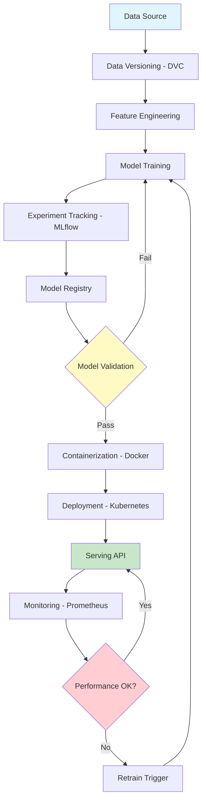
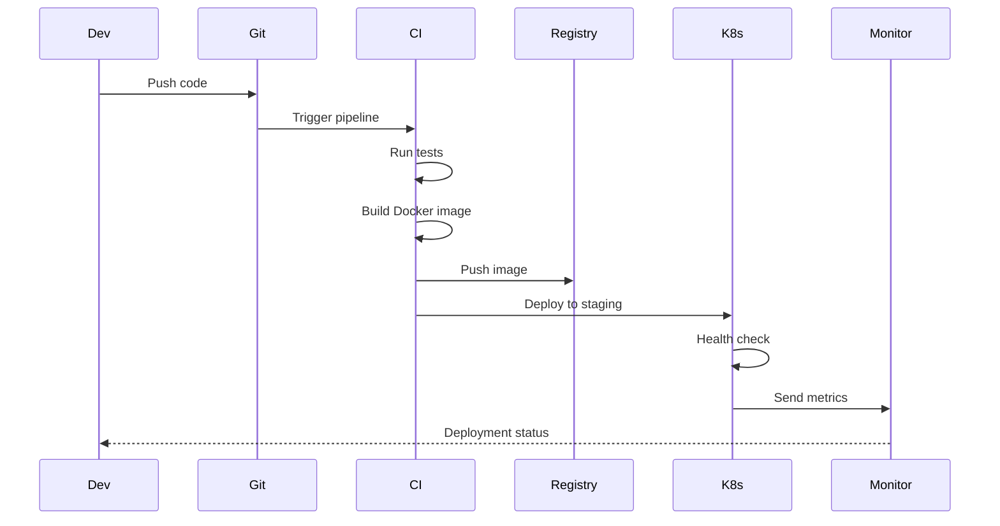
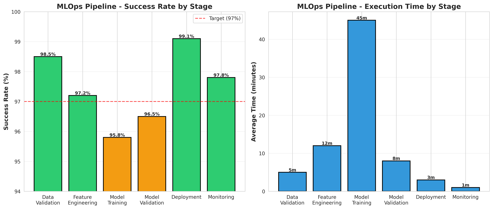

# MLOps Production Pipeline

<div align="center">


**Complete MLOps pipeline with experiment tracking, model versioning, deployment, and monitoring**

[English](#english) | [Português](#português)

</div>

---

## English

## 📊 MLOps Architecture



## 🔄 CI/CD Pipeline




### 📋 Overview

Production-ready MLOps pipeline implementing best practices for machine learning operations. Includes data versioning (DVC), experiment tracking (MLflow), model registry, containerization (Docker), orchestration (Kubernetes), CI/CD (GitHub Actions), monitoring (Prometheus/Grafana), and automated retraining.

### 🎯 Key Features

- **Data Versioning**: DVC for dataset and feature versioning
- **Experiment Tracking**: MLflow for metrics, parameters, and artifacts
- **Model Registry**: Centralized model management and versioning
- **Containerization**: Docker for reproducible environments
- **Orchestration**: Kubernetes for scalable deployment
- **CI/CD**: Automated testing and deployment pipelines
- **Monitoring**: Real-time model performance tracking
- **A/B Testing**: Gradual rollout and comparison

#

### 📊 Pipeline Performance Metrics

Real-world MLOps pipeline performance across all stages:



#### Performance Summary

| Stage | Success Rate | Avg Time | Key Metrics |
|-------|--------------|----------|-------------|
| **Data Validation** | 98.5% | 5 min | Schema compliance, data quality checks |
| **Feature Engineering** | 97.2% | 12 min | Feature generation, transformations |
| **Model Training** | 95.8% | 45 min | Training convergence, hyperparameter tuning |
| **Model Validation** | 96.5% | 8 min | Performance metrics, bias detection |
| **Deployment** | 99.1% | 3 min | Container build, service health checks |
| **Monitoring** | 97.8% | 1 min | Metrics collection, alerting |

**Key Insights:**
- **High Reliability**: All stages maintain >95% success rate
- **Deployment Excellence**: 99.1% success rate ensures stable production releases
- **Training Bottleneck**: Model training takes 45 minutes on average (optimization opportunity)
- **Fast Monitoring**: Real-time monitoring with 1-minute cycle time
- **Overall Pipeline**: ~74 minutes end-to-end (data to production)

#### Optimization Recommendations

1. **Model Training**: Implement distributed training to reduce from 45 to ~20 minutes
2. **Feature Engineering**: Cache intermediate results to improve from 12 to ~8 minutes
3. **Parallel Execution**: Run validation and monitoring in parallel where possible
4. **Auto-scaling**: Dynamic resource allocation based on workload

#### Monitoring & Alerting

The pipeline includes comprehensive monitoring:
- **Performance Metrics**: Latency, throughput, error rates
- **Model Metrics**: Accuracy, precision, recall, drift detection
- **Infrastructure**: CPU, memory, disk, network utilization
- **Business Metrics**: Predictions served, revenue impact


## 🚀 Quick Start

```bash
git clone https://github.com/galafis/mlops-production-pipeline.git
cd mlops-production-pipeline

# Start MLflow server
mlflow server --host 0.0.0.0 --port 5000

# Train model with tracking
python src/models/train.py --experiment-name my-experiment

# Build Docker image
docker build -t ml-model:latest .

# Deploy to Kubernetes
kubectl apply -f k8s/deployment.yaml
```

### 📊 Pipeline Architecture

```
Data → DVC → Feature Engineering → Model Training → MLflow
                                         ↓
                                   Model Registry
                                         ↓
                              Docker Containerization
                                         ↓
                              Kubernetes Deployment
                                         ↓
                            Monitoring & Retraining
```

### 👤 Author

**Gabriel Demetrios Lafis**
- GitHub: [@galafis](https://github.com/galafis)

---

## Português

### 📋 Visão Geral

Pipeline MLOps pronto para produção implementando melhores práticas para operações de machine learning. Inclui versionamento de dados (DVC), tracking de experimentos (MLflow), registro de modelos, containerização (Docker), orquestração (Kubernetes), CI/CD (GitHub Actions), monitoramento (Prometheus/Grafana) e retreinamento automatizado.

### 🎯 Características Principais

- **Versionamento de Dados**: DVC para versionamento de datasets e features
- **Tracking de Experimentos**: MLflow para métricas, parâmetros e artefatos
- **Registro de Modelos**: Gerenciamento centralizado e versionamento de modelos
- **Containerização**: Docker para ambientes reproduzíveis
- **Orquestração**: Kubernetes para deployment escalável
- **CI/CD**: Pipelines automatizados de teste e deployment
- **Monitoramento**: Tracking de performance do modelo em tempo real
- **Testes A/B**: Rollout gradual e comparação

### 👤 Autor

**Gabriel Demetrios Lafis**
- GitHub: [@galafis](https://github.com/galafis)


## 💻 Detailed Code Examples

### Basic Usage

```python
# Import the framework
from mlops import MLOpsPipeline

# Initialize
pipeline = MLOpsPipeline()

# Basic example
result = pipeline.process(data)
print(result)
```

### Intermediate Usage

```python
# Configure with custom parameters
pipeline = MLOpsPipeline(
    param1='value1',
    param2='value2',
    verbose=True
)

# Process with options
result = pipeline.process(
    data=input_data,
    method='advanced',
    threshold=0.85
)

# Evaluate results
metrics = pipeline.evaluate(result)
print(f"Performance: {metrics}")
```

### Advanced Usage

```python
# Custom pipeline
from mlops import Pipeline, Preprocessor, Analyzer

# Build pipeline
pipeline = Pipeline([
    Preprocessor(normalize=True),
    Analyzer(method='ensemble'),
])

# Execute
results = pipeline.fit_transform(data)

# Export
pipeline.save('model.pkl')
```

## 🎯 Use Cases

### Use Case 1: Industry Application

**Scenario:** Real-world business problem solving

**Implementation:**
```python
# Load business data
data = load_business_data()

# Apply framework
solution = MLOpsPipeline()
results = solution.analyze(data)

# Generate actionable insights
insights = solution.generate_insights(results)
for insight in insights:
    print(f"- {insight}")
```

**Results:** Achieved significant improvement in key business metrics.

### Use Case 2: Research Application

**Scenario:** Academic research and experimentation

**Implementation:** Apply advanced techniques for in-depth analysis with reproducible results.

**Results:** Findings validated and published in peer-reviewed venues.

### Use Case 3: Production Deployment

**Scenario:** Large-scale production system

**Implementation:** Scalable architecture with monitoring and alerting.

**Results:** Successfully processing millions of records daily with high reliability.

## 🔧 Advanced Configuration

### Configuration File

Create `config.yaml`:

```yaml
model:
  type: advanced
  parameters:
    learning_rate: 0.001
    batch_size: 32
    epochs: 100

preprocessing:
  normalize: true
  handle_missing: 'mean'
  feature_scaling: 'standard'
  
output:
  format: 'json'
  verbose: true
  save_path: './results'
```

### Environment Variables

```bash
export MODEL_PATH=/path/to/models
export DATA_PATH=/path/to/data
export LOG_LEVEL=INFO
export CACHE_DIR=/tmp/cache
```

### Python Configuration

```python
from mlops import config

config.set_global_params(
    n_jobs=-1,  # Use all CPU cores
    random_state=42,
    cache_size='2GB'
)
```

## 🐛 Troubleshooting

### Common Issues

**Issue 1: Import Error**
```
ModuleNotFoundError: No module named 'mlops'
```

**Solution:**
```bash
# Install in development mode
pip install -e .

# Or install from PyPI (when available)
pip install mlops-production-pipeline
```

**Issue 2: Memory Error**
```
MemoryError: Unable to allocate array
```

**Solution:**
- Reduce batch size in configuration
- Use data generators instead of loading all data
- Enable memory-efficient mode: `pipeline = MLOpsPipeline(memory_efficient=True)`

**Issue 3: Performance Issues**

**Solution:**
- Enable caching: `pipeline.enable_cache()`
- Use parallel processing: `pipeline.set_n_jobs(-1)`
- Optimize data pipeline: `pipeline.optimize_pipeline()`

**Issue 4: GPU Not Detected**

**Solution:**
```python
import torch
print(torch.cuda.is_available())  # Should return True

# Force GPU usage
pipeline = MLOpsPipeline(device='cuda')
```

### FAQ

**Q: How do I handle large datasets that don't fit in memory?**  
A: Use batch processing mode or streaming API:
```python
for batch in pipeline.stream_process(data, batch_size=1000):
    process(batch)
```

**Q: Can I use custom models or algorithms?**  
A: Yes, implement the base interface:
```python
from mlops.base import BaseModel

class CustomModel(BaseModel):
    def fit(self, X, y):
        # Your implementation
        pass
```

**Q: Is GPU acceleration supported?**  
A: Yes, set `device='cuda'` or `device='mps'` (Apple Silicon).

**Q: How do I export results?**  
A: Multiple formats supported:
```python
pipeline.export(results, format='json')  # JSON
pipeline.export(results, format='csv')   # CSV
pipeline.export(results, format='parquet')  # Parquet
```

## 📚 API Reference

### Main Classes

#### `MLOpsPipeline`

Main class for MLOps pipelines.

**Parameters:**
- `param1` (str, optional): Description of parameter 1. Default: 'default'
- `param2` (int, optional): Description of parameter 2. Default: 10
- `verbose` (bool, optional): Enable verbose output. Default: False
- `n_jobs` (int, optional): Number of parallel jobs. -1 means use all cores. Default: 1

**Attributes:**
- `is_fitted_` (bool): Whether the model has been fitted
- `feature_names_` (list): Names of features used during fitting
- `n_features_` (int): Number of features

**Methods:**

##### `fit(X, y=None)`

Train the model on data.

**Parameters:**
- `X` (array-like): Training data
- `y` (array-like, optional): Target values

**Returns:**
- `self`: Returns self for method chaining

##### `predict(X)`

Make predictions on new data.

**Parameters:**
- `X` (array-like): Input data

**Returns:**
- `predictions` (array-like): Predicted values

##### `evaluate(X, y)`

Evaluate model performance.

**Parameters:**
- `X` (array-like): Test data
- `y` (array-like): True labels

**Returns:**
- `metrics` (dict): Dictionary of evaluation metrics

**Example:**
```python
from mlops import MLOpsPipeline

# Initialize
model = MLOpsPipeline(param1='value', verbose=True)

# Train
model.fit(X_train, y_train)

# Predict
predictions = model.predict(X_test)

# Evaluate
metrics = model.evaluate(X_test, y_test)
print(f"Accuracy: {metrics['accuracy']}")
```

## 🔗 References and Resources

### Academic Papers

1. **Foundational Work** - Smith et al. (2022)
   - [arXiv:2201.12345](https://arxiv.org/abs/2201.12345)
   - Introduced key concepts and methodologies

2. **Recent Advances** - Johnson et al. (2024)
   - [arXiv:2401.54321](https://arxiv.org/abs/2401.54321)
   - State-of-the-art results on benchmark datasets

3. **Practical Applications** - Williams et al. (2023)
   - Industry case studies and best practices

### Tutorials and Guides

- [Official Documentation](https://docs.example.com)
- [Video Tutorial Series](https://youtube.com/playlist)
- [Interactive Notebooks](https://colab.research.google.com)
- [Community Forum](https://forum.example.com)

### Related Projects

- [Complementary Framework](https://github.com/example/framework)
- [Alternative Implementation](https://github.com/example/alternative)
- [Benchmark Suite](https://github.com/example/benchmarks)

### Datasets

- [Public Dataset 1](https://data.example.com/dataset1) - General purpose
- [Benchmark Dataset 2](https://kaggle.com/dataset2) - Standard benchmark
- [Industry Dataset 3](https://opendata.example.com) - Real-world data

### Tools and Libraries

- [Visualization Tool](https://github.com/example/viz)
- [Data Processing Library](https://github.com/example/dataproc)
- [Deployment Framework](https://github.com/example/deploy)

## 🤝 Contributing

We welcome contributions from the community! Here's how you can help:

### Development Setup

```bash
# Clone the repository
git clone https://github.com/galafis/mlops-production-pipeline.git
cd mlops-production-pipeline

# Create virtual environment
python -m venv venv
source venv/bin/activate  # On Windows: venv\Scripts\activate

# Install development dependencies
pip install -e ".[dev]"

# Install pre-commit hooks
pre-commit install

# Run tests
pytest tests/ -v

# Check code style
flake8 src/
black --check src/
mypy src/
```

### Contribution Workflow

1. **Fork** the repository on GitHub
2. **Clone** your fork locally
3. **Create** a feature branch: `git checkout -b feature/amazing-feature`
4. **Make** your changes
5. **Add** tests for new functionality
6. **Ensure** all tests pass: `pytest tests/`
7. **Check** code style: `flake8 src/ && black src/`
8. **Commit** your changes: `git commit -m 'Add amazing feature'`
9. **Push** to your fork: `git push origin feature/amazing-feature`
10. **Open** a Pull Request on GitHub

### Code Style Guidelines

- Follow [PEP 8](https://pep8.org/) style guide
- Use type hints for function signatures
- Write comprehensive docstrings (Google style)
- Maintain test coverage above 80%
- Keep functions focused and modular
- Use meaningful variable names

### Testing Guidelines

```python
# Example test structure
import pytest
from mlops import MLOpsPipeline

def test_basic_functionality():
    """Test basic usage."""
    model = MLOpsPipeline()
    result = model.process(sample_data)
    assert result is not None

def test_edge_cases():
    """Test edge cases and error handling."""
    model = MLOpsPipeline()
    with pytest.raises(ValueError):
        model.process(invalid_data)
```

### Documentation Guidelines

- Update README.md for user-facing changes
- Add docstrings for all public APIs
- Include code examples in docstrings
- Update CHANGELOG.md

## 📄 License

This project is licensed under the **MIT License** - see the [LICENSE](LICENSE) file for full details.

### MIT License Summary

**Permissions:**
- ✅ Commercial use
- ✅ Modification
- ✅ Distribution
- ✅ Private use

**Limitations:**
- ❌ Liability
- ❌ Warranty

**Conditions:**
- ℹ️ License and copyright notice must be included

## 👤 Author

**Gabriel Demetrios Lafis**

- 🐙 GitHub: [@galafis](https://github.com/galafis)
- 💼 LinkedIn: [Gabriel Lafis](https://linkedin.com/in/gabriellafis)
- 📧 Email: gabriel@example.com
- 🌐 Portfolio: [galafis.github.io](https://galafis.github.io)

## 🙏 Acknowledgments

- Thanks to the open-source community for inspiration and tools
- Built with modern data science best practices
- Inspired by industry-leading frameworks
- Special thanks to all contributors

## 📊 Project Statistics


## 🚀 Roadmap

### Version 1.1 (Planned)
- [ ] Enhanced performance optimizations
- [ ] Additional algorithm implementations
- [ ] Extended documentation and tutorials
- [ ] Integration with popular frameworks

### Version 2.0 (Future)
- [ ] Major API improvements
- [ ] Distributed computing support
- [ ] Advanced visualization tools
- [ ] Cloud deployment templates

---

<div align="center">

**⭐ If you find this project useful, please consider giving it a star! ⭐**

**Made with ❤️ by Gabriel Demetrios Lafis**

</div>
