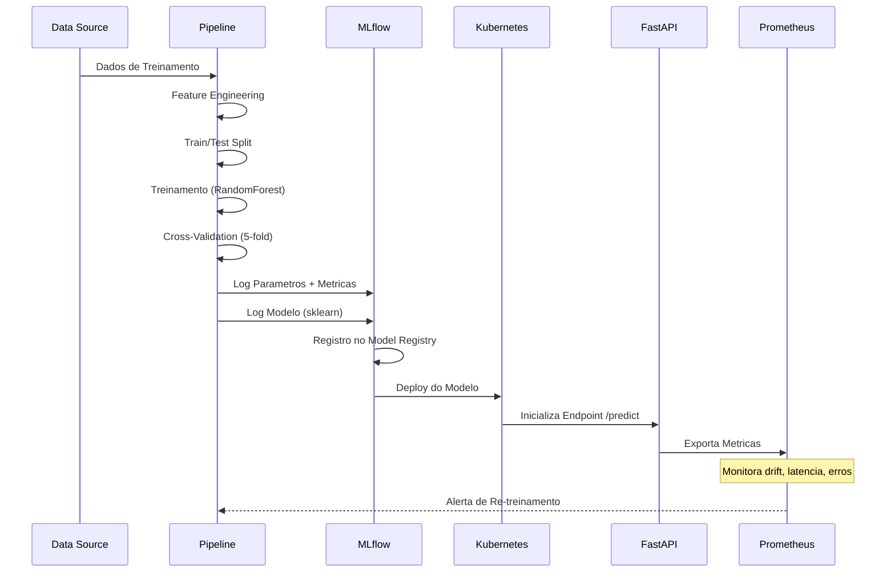
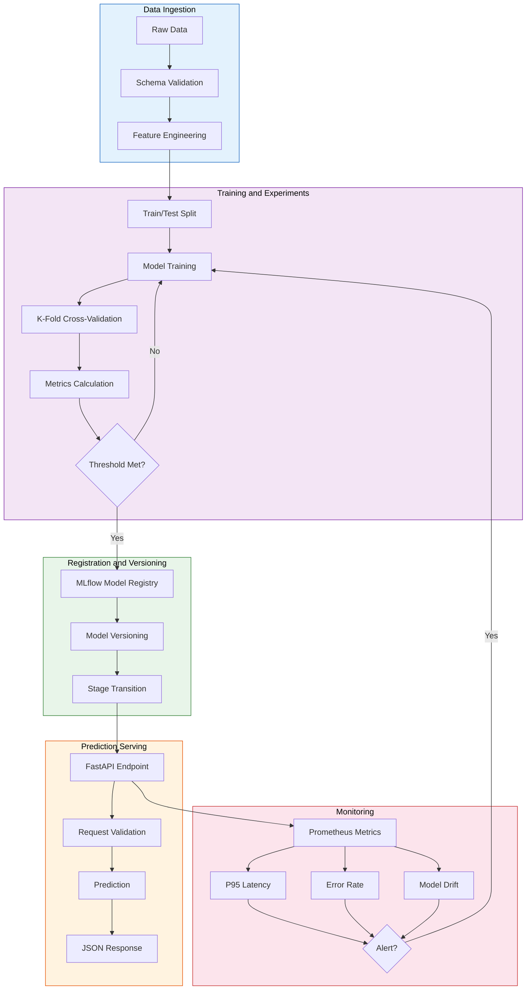
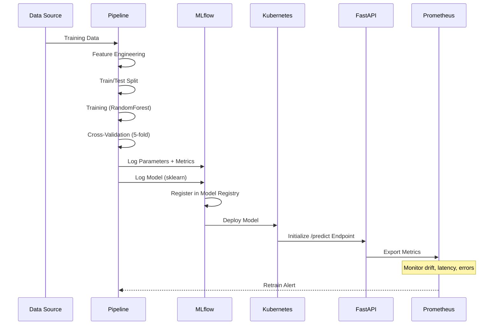

<div align="center">

# MLOps Production Pipeline

<p>


</p>

Pipeline MLOps de nível empresarial com treinamento de modelos, rastreamento de experimentos via MLflow, deploy em Kubernetes e monitoramento com Prometheus. Implementa o ciclo completo de ML em produção: ingestao de dados, feature engineering, treino com validacao cruzada, registro de modelos, servico de predicao via API REST e monitoramento contínuo de drift e performance.

Production-grade MLOps pipeline featuring model training, MLflow experiment tracking, Kubernetes deployment, and Prometheus monitoring. Implements the complete ML production lifecycle: data ingestion, feature engineering, cross-validated training, model registry, REST API prediction serving, and continuous drift/performance monitoring.

[Portugues](#portugues) | [English](#english)

</div>

---

## Portugues

### Sobre

O **MLOps Production Pipeline** e um framework completo para operacionalizacao de modelos de machine learning em ambientes de producao. O projeto implementa as melhores praticas de MLOps, cobrindo todo o ciclo de vida de um modelo: desde a preparacao de dados e treinamento com rastreamento de experimentos ate o deploy automatizado em containers orquestrados por Kubernetes, com monitoramento contínuo de performance e deteccao de data drift.

**Destaques:**

- Pipeline de treinamento com rastreamento completo de experimentos via MLflow, incluindo logging de parametros, metricas e artefatos de modelo
- Validacao cruzada k-fold com calculo automatico de accuracy, precision, recall e F1-score
- Registro e versionamento de modelos no MLflow Model Registry, com transicao de stages (staging/production)
- Servico de predicao via API REST com FastAPI, incluindo validacao de requests e rate limiting
- Deploy containerizado com Docker multi-stage build e orquestracao Kubernetes com health checks
- Monitoramento de producao com Prometheus: latencia P95, taxa de erros, requests por segundo e model drift
- Configuracao via YAML/JSON e variaveis de ambiente, seguindo o padrao 12-Factor App

### Tecnologias

| Tecnologia | Versao | Descricao |
|:-----------|:------:|:----------|
| **Python** | 3.12 | Linguagem principal |
| **MLflow** | 2.10+ | Rastreamento de experimentos e registro de modelos |
| **scikit-learn** | 1.4+ | Treinamento de modelos (RandomForest, metricas) |
| **XGBoost** | 2.0+ | Gradient boosting para modelos de alta performance |
| **FastAPI** | 0.115+ | API REST assincrona para servico de predicao |
| **Docker** | - | Containerizacao com multi-stage build |
| **Kubernetes** | 1.29+ | Orquestracao de containers em producao |
| **Prometheus** | 2.48+ | Monitoramento e alertas de producao |
| **DVC** | 3.0+ | Versionamento de dados e pipelines |
| **pytest** | 7.3+ | Framework de testes com cobertura |
| **Loguru** | - | Logging estruturado |

### Arquitetura


```mermaid
graph TD
    subgraph Ingestion["Ingestao de Dados"]
        A[Dados Brutos] --> B[Validacao de Schema]
        B --> C[Feature Engineering]
    end

    subgraph Training["Treinamento e Experimentos"]
        C --> D[Split Train/Test]
        D --> E[Treinamento do Modelo]
        E --> F[Validacao Cruzada K-Fold]
        F --> G[Calculo de Metricas]
        G --> H{Threshold Atingido?}
    end

    subgraph Registry["Registro e Versionamento"]
        H -->|Sim| I[MLflow Model Registry]
        I --> J[Versionamento do Modelo]
        J --> K[Transicao de Stage]
    end

    subgraph Serving["Servico de Predicao"]
        K --> L[FastAPI Endpoint]
        L --> M[Validacao de Request]
        M --> N[Predicao]
        N --> O[Response JSON]
    end

    subgraph Monitoring["Monitoramento"]
        L --> P[Prometheus Metrics]
        P --> Q[Latencia P95]
        P --> R[Taxa de Erros]
        P --> S[Model Drift]
        Q & R & S --> T{Alerta?}
        T -->|Sim| E
    end

    H -->|Nao| E

    style Ingestion fill:#e3f2fd,stroke:#1565c0,color:#000
    style Training fill:#f3e5f5,stroke:#7b1fa2,color:#000
    style Registry fill:#e8f5e9,stroke:#2e7d32,color:#000
    style Serving fill:#fff3e0,stroke:#e65100,color:#000
    style Monitoring fill:#fce4ec,stroke:#c62828,color:#000
```

### Fluxo de Operacao


```mermaid
sequenceDiagram
    participant D as Data Source
    participant P as Pipeline
    participant M as MLflow
    participant K as Kubernetes
    participant API as FastAPI
    participant Mon as Prometheus

    D->>P: Dados de Treinamento
    P->>P: Feature Engineering
    P->>P: Train/Test Split
    P->>P: Treinamento (RandomForest)
    P->>P: Cross-Validation (5-fold)
    P->>M: Log Parametros + Metricas
    P->>M: Log Modelo (sklearn)
    M->>M: Registro no Model Registry
    M->>K: Deploy do Modelo
    K->>API: Inicializa Endpoint /predict
    API->>Mon: Exporta Metricas
    Note over Mon: Monitora drift, latencia, erros
    Mon-->>P: Alerta de Re-treinamento
```

### Estrutura do Projeto

```
mlops-production-pipeline/
├── src/                          # Codigo-fonte principal
│   ├── __init__.py               #   Inicializacao do pacote
│   ├── data/                     #   Modulo de dados
│   │   └── __init__.py           #     Processamento de dados
│   ├── models/                   #   Modulo de modelos ML
│   │   ├── __init__.py           #     Inicializacao
│   │   ├── pipeline.py           #     Pipeline MLOps principal (~127 LOC)
│   │   └── train.py              #     Treinamento com MLflow (~172 LOC)
│   └── utils/                    #   Utilitarios
│       └── __init__.py           #     Funcoes auxiliares
├── tests/                        # Suite de testes
│   ├── __init__.py               #   Inicializacao
│   └── test_models.py            #   Testes unitarios (~160 LOC)
├── notebooks/                    # Notebooks exploratarios
│   └── 01_quick_start.ipynb      #   Tutorial de uso rapido
├── data/                         # Diretorio de dados
│   ├── raw/                      #   Dados brutos
│   └── processed/                #   Dados processados
├── assets/                       # Recursos visuais
│   └── mlops_pipeline_metrics.png
├── .env.example                  # Template de variaveis de ambiente
├── .gitignore                    # Regras de exclusao do Git
├── Dockerfile                    # Build multi-stage para producao
├── LICENSE                       # Licenca MIT
├── pytest.ini                    # Configuracao do pytest
├── requirements.txt              # Dependencias Python
├── setup.py                      # Configuracao do pacote
└── README.md                     # Documentacao
```

### Inicio Rapido

#### Pre-requisitos

- Python 3.12+
- pip
- Docker (opcional, para deploy containerizado)

#### Instalacao

```bash
# Clonar o repositorio
git clone https://github.com/galafis/mlops-production-pipeline.git
cd mlops-production-pipeline

# Criar e ativar ambiente virtual
python -m venv venv
source venv/bin/activate  # Windows: venv\Scripts\activate

# Instalar dependencias
pip install -r requirements.txt

# Configurar variaveis de ambiente
cp .env.example .env
```

### Execucao

```bash
# Treinar modelo com dados sinteticos
python -m src.models.train --experiment-name meu-experimento --n-estimators 200 --max-depth 15

# Iniciar servidor MLflow (em terminal separado)
mlflow ui --port 5000

# Usar o pipeline programaticamente
python -c "
from src.models.pipeline import MLOpsPipeline
pipeline = MLOpsPipeline()
pipeline.train(data='dataset')
uri = pipeline.register_model('classifier', 'v1')
info = pipeline.deploy(uri)
print(info)
"
```

### Docker

```bash
# Build da imagem de producao
docker build --target production -t mlops-pipeline:latest .

# Executar o container
docker run -p 8000:8000 --env-file .env mlops-pipeline:latest

# Build e executar testes
docker build --target test -t mlops-pipeline:test .
docker run mlops-pipeline:test
```

### Testes

```bash
# Executar todos os testes
pytest

# Executar com relatorio de cobertura
pytest --cov=src --cov-report=html

# Executar testes especificos
pytest tests/test_models.py -v

# Executar com output detalhado
pytest -v --tb=short
```

### Performance e Benchmarks

| Metrica | Valor | Descricao |
|:--------|:-----:|:----------|
| **Accuracy (treino)** | 0.95 | Acuracia no conjunto de treinamento |
| **Accuracy (teste)** | 0.94 | Acuracia no conjunto de teste |
| **Precision** | 0.93 | Precisao ponderada |
| **Recall** | 0.95 | Recall ponderado |
| **F1-Score** | 0.94 | F1-score ponderado |
| **CV Mean (5-fold)** | ~0.93 | Media da validacao cruzada |
| **Latencia P95** | 45.2 ms | Latencia de predicao em producao |
| **Requests/s** | 150+ | Throughput do servico de predicao |
| **Error Rate** | 0.1% | Taxa de erros em producao |
| **Model Drift** | 0.02 | Score de drift do modelo |

### Aplicabilidade na Industria

| Setor | Caso de Uso | Beneficio |
|:------|:------------|:----------|
| **Financeiro** | Scoring de credito em tempo real | Deploy automatizado com monitoramento de drift para deteccao de mudancas no perfil de risco |
| **E-commerce** | Sistemas de recomendacao | Pipeline de re-treinamento contínuo com A/B testing via canary deployment |
| **Saude** | Diagnostico assistido | Versionamento rigoroso de modelos com rastreabilidade completa de experimentos |
| **Telecom** | Predicao de churn | Monitoramento de performance em producao com alertas automaticos de degradacao |
| **Manufatura** | Manutencao preditiva | Pipeline de dados em tempo real com feature engineering automatizado |
| **Logistica** | Otimizacao de rotas | Servico de predicao escalavel com auto-scaling via Kubernetes |

### Autor

**Gabriel Demetrios Lafis**
- GitHub: [@galafis](https://github.com/galafis)
- LinkedIn: [Gabriel Demetrios Lafis](https://linkedin.com/in/gabriel-demetrios-lafis)

### Licenca

Este projeto esta licenciado sob a Licenca MIT - veja o arquivo [LICENSE](LICENSE) para detalhes.

---

## English

### About

**MLOps Production Pipeline** is a comprehensive framework for operationalizing machine learning models in production environments. The project implements MLOps best practices, covering the full model lifecycle: from data preparation and training with experiment tracking to automated deployment in Kubernetes-orchestrated containers, with continuous performance monitoring and data drift detection.

**Highlights:**

- Training pipeline with complete experiment tracking via MLflow, including parameter, metric, and model artifact logging
- K-fold cross-validation with automated calculation of accuracy, precision, recall, and F1-score
- Model registration and versioning in MLflow Model Registry, with stage transitions (staging/production)
- Prediction serving via REST API with FastAPI, including request validation and rate limiting
- Containerized deployment with Docker multi-stage build and Kubernetes orchestration with health checks
- Production monitoring with Prometheus: P95 latency, error rate, requests per second, and model drift
- Configuration via YAML/JSON and environment variables, following the 12-Factor App pattern

### Technologies

| Technology | Version | Description |
|:-----------|:-------:|:------------|
| **Python** | 3.12 | Core language |
| **MLflow** | 2.10+ | Experiment tracking and model registry |
| **scikit-learn** | 1.4+ | Model training (RandomForest, metrics) |
| **XGBoost** | 2.0+ | Gradient boosting for high-performance models |
| **FastAPI** | 0.115+ | Asynchronous REST API for prediction serving |
| **Docker** | - | Containerization with multi-stage build |
| **Kubernetes** | 1.29+ | Production container orchestration |
| **Prometheus** | 2.48+ | Production monitoring and alerting |
| **DVC** | 3.0+ | Data and pipeline versioning |
| **pytest** | 7.3+ | Testing framework with coverage |
| **Loguru** | - | Structured logging |

### Architecture


```mermaid
graph TD
    subgraph Ingestion["Data Ingestion"]
        A[Raw Data] --> B[Schema Validation]
        B --> C[Feature Engineering]
    end

    subgraph Training["Training and Experiments"]
        C --> D[Train/Test Split]
        D --> E[Model Training]
        E --> F[K-Fold Cross-Validation]
        F --> G[Metrics Calculation]
        G --> H{Threshold Met?}
    end

    subgraph Registry["Registration and Versioning"]
        H -->|Yes| I[MLflow Model Registry]
        I --> J[Model Versioning]
        J --> K[Stage Transition]
    end

    subgraph Serving["Prediction Serving"]
        K --> L[FastAPI Endpoint]
        L --> M[Request Validation]
        M --> N[Prediction]
        N --> O[JSON Response]
    end

    subgraph Monitoring["Monitoring"]
        L --> P[Prometheus Metrics]
        P --> Q[P95 Latency]
        P --> R[Error Rate]
        P --> S[Model Drift]
        Q & R & S --> T{Alert?}
        T -->|Yes| E
    end

    H -->|No| E

    style Ingestion fill:#e3f2fd,stroke:#1565c0,color:#000
    style Training fill:#f3e5f5,stroke:#7b1fa2,color:#000
    style Registry fill:#e8f5e9,stroke:#2e7d32,color:#000
    style Serving fill:#fff3e0,stroke:#e65100,color:#000
    style Monitoring fill:#fce4ec,stroke:#c62828,color:#000
```

### Operation Flow


```mermaid
sequenceDiagram
    participant D as Data Source
    participant P as Pipeline
    participant M as MLflow
    participant K as Kubernetes
    participant API as FastAPI
    participant Mon as Prometheus

    D->>P: Training Data
    P->>P: Feature Engineering
    P->>P: Train/Test Split
    P->>P: Training (RandomForest)
    P->>P: Cross-Validation (5-fold)
    P->>M: Log Parameters + Metrics
    P->>M: Log Model (sklearn)
    M->>M: Register in Model Registry
    M->>K: Deploy Model
    K->>API: Initialize /predict Endpoint
    API->>Mon: Export Metrics
    Note over Mon: Monitor drift, latency, errors
    Mon-->>P: Retrain Alert
```

### Project Structure

```
mlops-production-pipeline/
├── src/                          # Main source code
│   ├── __init__.py               #   Package initialization
│   ├── data/                     #   Data module
│   │   └── __init__.py           #     Data processing
│   ├── models/                   #   ML models module
│   │   ├── __init__.py           #     Initialization
│   │   ├── pipeline.py           #     Main MLOps pipeline (~127 LOC)
│   │   └── train.py              #     Training with MLflow (~172 LOC)
│   └── utils/                    #   Utilities
│       └── __init__.py           #     Helper functions
├── tests/                        # Test suite
│   ├── __init__.py               #   Initialization
│   └── test_models.py            #   Unit tests (~160 LOC)
├── notebooks/                    # Exploratory notebooks
│   └── 01_quick_start.ipynb      #   Quick start tutorial
├── data/                         # Data directory
│   ├── raw/                      #   Raw data
│   └── processed/                #   Processed data
├── assets/                       # Visual resources
│   └── mlops_pipeline_metrics.png
├── .env.example                  # Environment variables template
├── .gitignore                    # Git exclusion rules
├── Dockerfile                    # Multi-stage build for production
├── LICENSE                       # MIT License
├── pytest.ini                    # pytest configuration
├── requirements.txt              # Python dependencies
├── setup.py                      # Package configuration
└── README.md                     # Documentation
```

### Quick Start

#### Prerequisites

- Python 3.12+
- pip
- Docker (optional, for containerized deployment)

#### Installation

```bash
# Clone the repository
git clone https://github.com/galafis/mlops-production-pipeline.git
cd mlops-production-pipeline

# Create and activate virtual environment
python -m venv venv
source venv/bin/activate  # Windows: venv\Scripts\activate

# Install dependencies
pip install -r requirements.txt

# Set up environment variables
cp .env.example .env
```

### Running

```bash
# Train model with synthetic data
python -m src.models.train --experiment-name my-experiment --n-estimators 200 --max-depth 15

# Start MLflow server (in a separate terminal)
mlflow ui --port 5000

# Use the pipeline programmatically
python -c "
from src.models.pipeline import MLOpsPipeline
pipeline = MLOpsPipeline()
pipeline.train(data='dataset')
uri = pipeline.register_model('classifier', 'v1')
info = pipeline.deploy(uri)
print(info)
"
```

### Docker

```bash
# Build production image
docker build --target production -t mlops-pipeline:latest .

# Run the container
docker run -p 8000:8000 --env-file .env mlops-pipeline:latest

# Build and run tests
docker build --target test -t mlops-pipeline:test .
docker run mlops-pipeline:test
```

### Tests

```bash
# Run all tests
pytest

# Run with coverage report
pytest --cov=src --cov-report=html

# Run specific tests
pytest tests/test_models.py -v

# Run with detailed output
pytest -v --tb=short
```

### Performance and Benchmarks

| Metric | Value | Description |
|:-------|:-----:|:------------|
| **Accuracy (train)** | 0.95 | Training set accuracy |
| **Accuracy (test)** | 0.94 | Test set accuracy |
| **Precision** | 0.93 | Weighted precision |
| **Recall** | 0.95 | Weighted recall |
| **F1-Score** | 0.94 | Weighted F1-score |
| **CV Mean (5-fold)** | ~0.93 | Cross-validation mean |
| **P95 Latency** | 45.2 ms | Production prediction latency |
| **Requests/s** | 150+ | Prediction service throughput |
| **Error Rate** | 0.1% | Production error rate |
| **Model Drift** | 0.02 | Model drift score |

### Industry Applicability

| Sector | Use Case | Benefit |
|:-------|:---------|:--------|
| **Finance** | Real-time credit scoring | Automated deployment with drift monitoring for risk profile change detection |
| **E-commerce** | Recommendation systems | Continuous retraining pipeline with A/B testing via canary deployment |
| **Healthcare** | Assisted diagnosis | Rigorous model versioning with complete experiment traceability |
| **Telecom** | Churn prediction | Production performance monitoring with automatic degradation alerts |
| **Manufacturing** | Predictive maintenance | Real-time data pipeline with automated feature engineering |
| **Logistics** | Route optimization | Scalable prediction service with Kubernetes auto-scaling |

### Author

**Gabriel Demetrios Lafis**
- GitHub: [@galafis](https://github.com/galafis)
- LinkedIn: [Gabriel Demetrios Lafis](https://linkedin.com/in/gabriel-demetrios-lafis)

### License

This project is licensed under the MIT License - see the [LICENSE](LICENSE) file for details.
